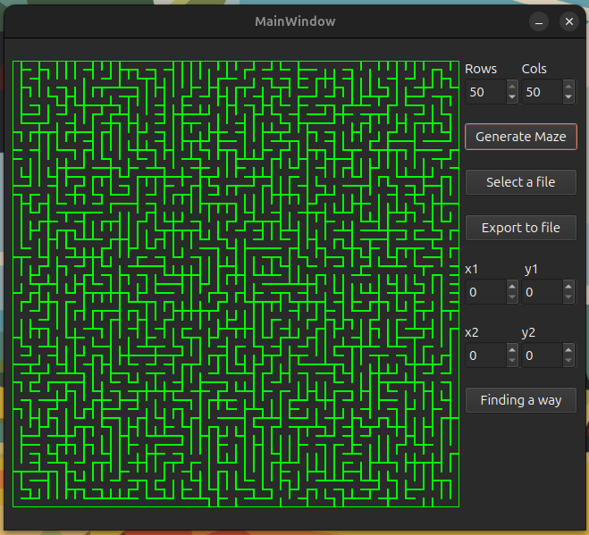

# Maze

Реализация проекта Maze.

## Introduction

В данном проекте реализованы основные алгоритмы обработки лабиринтов: генерация, отрисовка, поиск решения.

## Описание лабиринта

Лабиринт может храниться в файле в виде количества строк и столбцов, а также двух матриц, содержащих положение вертикальных и горизонтальных стен соответственно. 
В первой матрице отображается наличие стены справа от каждой ячейки, а во второй - снизу. 

Пример подобного файла:  
```
4 4
0 0 0 1
1 0 1 1
0 1 0 1
0 0 0 1

1 0 1 0
0 0 1 0
1 1 0 1
1 1 1 1
```

## Реализация проекта Maze

Реализована программа Maze, позволяющая генерировать и отрисовывать идеальные лабиринты:

- Программа должна быть разработана на языке C++ стандарта C++17
- Сборка программы быть настроена с помощью Makefile со стандартным набором целей для GNU-программ: all, install, uninstall, clean, dvi, dist, tests.
- В программе должен быть реализован графический пользовательский интерфейс на базе GUI-библиотеки Qt
- В программе предусмотрена кнопка для загрузки лабиринта из файла, который задается в формате 
- Максимальный размер лабиринта - 50х50
- Загруженный лабиринт отрисовается на экране в поле размером 500 x 500 пикселей
- Толщина «стены» - 2 пикселя
- Размер самих ячеек лабиринта вычисляется таким образом, чтобы лабиринт занимал всё отведенное под него поле

## Генерация идеального лабиринта

Автоматическая генерация идеального лабиринта.
Идеальным считается лабиринт, в котором из каждой точки можно попасть в любую другую точку ровно одним способом.

- лабиринт генерируется согласно **алгоритму Эллера**
- Сгенерированный лабиринт не должен имеет изолированных областей и петель
- Обеспечено полное покрытие unit-тестами модуля генерации идеального лабиринта
- Пользователем вводится только размерность лабиринта: количество строк и столбцов
- Сгенерированный лабиринт сохраняется в файл в формате, описанном выше 
- Созданный лабиринт отображается на экране как указано в первой части

## Решение лабиринта

Добавлена возможность показать решение идеального лабиринта:
- Пользователем задаются начальная и конечная точки
- Маршрут, являющийся решением, отображается линией толщиной 2 пикселя, проходящей через середины всех ячеек лабиринта, через которые пролегает решение
- Обеспечено полное покрытие unit-тестами модуля решения лабиринта

## Сборка

Сборка программы настроена с помощью Makefile

* `make install` - Компиляция программы
* `make unistall` - Удаление программы
* `make dvi` - Генерирование документации через Doxygen
* `make dist` - Архивирование проекта
* `make test` - Покрытие unit-тестами c помощью библиотеки GTest
* `make style` - Проверка кода на Google style
* `make clean` - Удаление ненужных файлов

## Пример работы программы

* Генерация лабиринта 50x50



* Путь от точки A до точки B


